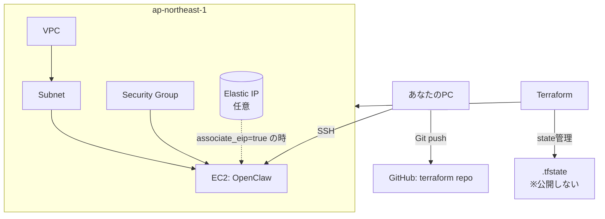
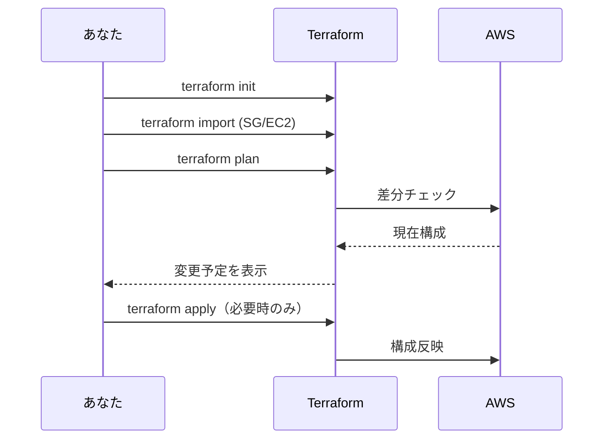

# OpenClaw on AWS 構成図（やさしめ）

Terraformで管理している対象のイメージです。

---

## いまのあなたの状態

- EC2: `i-xxxxxxxxxxxxxxxxx`
- VPC: `vpc-xxxxxxxxxxxxxxxxx`
- Subnet: `subnet-xxxxxxxxxxxxxxxxx`
- SG: `sg-xxxxxxxxxxxxxxxxx`
- EIP: なし（現在）

---

## 操作フロー図

---

## 注意

- `.tfstate` と `terraform.tfvars` は公開しない
- まずは `plan` まで（`apply` は意図が固まってから）
